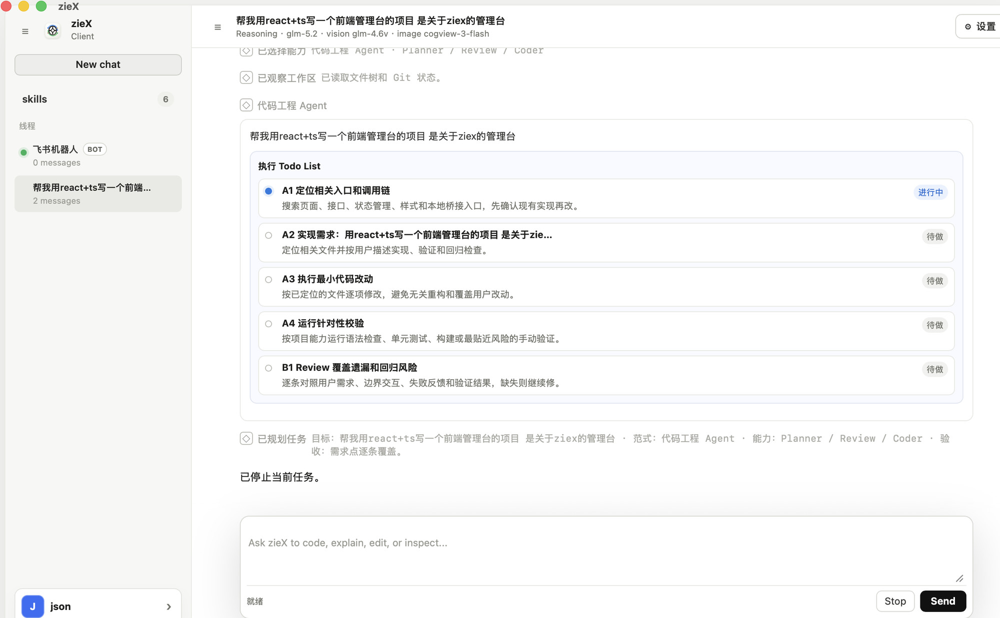

<div align="center">
  
</div>

<h1 align="center">zieX · 你的全能本地 AI Agent</h1>

<p align="center">官网：<a href="http://42.194.243.206">http://42.194.243.206</a> · 版本 v1.0.0 · 支持 OpenAI / 国产模型</p>

zieX 不只是聊天机器人。它能读懂你的代码仓库、分析 Excel 数据、生成专业文档和图表、运行命令行——**所有操作都在你的机器上真实完成**，而不是“看起来”完成。

它是一个 Codex 风格的本地桌面智能体（macOS 原生窗口 + 内置本地服务），把线程化对话、模型设置、流式输出、工作区上下文、真实工具执行整合在一个窗口里，并内置飞书机器人，让你随时随地一句话驱动它干活。

<div align="center">
  
</div>

> 上图：zieX 主界面预览——线程化对话、工具卡片实时展示、流式输出与工作区上下文整合在同一个窗口。

---

## 一、核心能力

从日常办公到专业开发，zieX 用一套 Agent 体系覆盖你的全部生产力场景：

| 能力 | 说明 |
| --- | --- |
| **真实代码执行** | 不只是聊天。能在工作区里读取、编写、修改代码文件，运行构建与测试，做完整的开发闭环。 |
| **本地隐私优先** | Agent 运行在你的机器上，文件操作、命令执行全部在本地完成。你的代码和数据永远不会离开设备。 |
| **智能意图路由** | 内置 Planner、Review、Artifact 等专职 Agent，自动判断意图并拆解任务，选择最优工具链完成目标。 |
| **深度文件理解** | 支持 PDF、Word、Excel、PPT、CSV、图片、代码仓库等多格式分析。Excel 自动统计、图片视觉识别、代码调用链追踪。 |
| **多模态创作** | 生成图片、SVG 图表、海报、文档报告、教育题目及题图。从需求到成品，一句话搞定。 |
| **联网研究能力** | 集成 Web Search 与 URL 抓取，实时获取最新信息、市场数据、技术文档，交叉验证后给出可靠分析。 |
| **飞书机器人** | 接入飞书会话，@ 机器人发指令即执行，结果与文件直接回传飞书，移动办公也能驱动本地 Agent。 |

---

## 二、工作流程

zieX 的每一次任务都走一条“从需求到成品”的闭环：

1. **描述你的需求** —— 用自然语言告诉 zieX 想做什么：写代码、分析数据、生成报告、搜索资料，任意任务。
2. **Agent 自动规划** —— Planner Agent 分析意图，拆解任务步骤，选择最合适的工具和 Agent 分支执行。
3. **真实执行与验证** —— 读取文件、运行命令、搜索网页、生成产物……每一步都在本地真实执行，并自动验证结果。
4. **交付完整结果** —— 代码已构建通过、文件已生成到指定路径、分析已附数据来源——拿到的是成品，不是草案。

---

## 三、Agent 工具集

zieX 的“行动力”来自一套可在本地真实执行的工具。Agent 在有界循环里**决策 ↔ 观察**，逐个调用它们：

- **文件类**：`read_file` 读文件 · `write_file` 写文件 · `inspect_file` 分析文件 · `analyze_spreadsheet` Excel 数据统计
- **命令类**：`shell` 运行命令行 · `git_status` 读取 Git 状态
- **搜索类**：`search` 本地检索 · `web_search` 联网搜索 · `fetch_url` 抓取网页
- **多模态类**：`screenshot_page` 网页截图 · `crop_image` 图片裁剪 · `create_image` 生成图片
- **创作类**：`create_document` 生成文档/报告/海报 · `create_image` 生成图表与题图
- **编排与安全类**：`parallel` 并行执行 · `permission` 权限检查 · `snapshot` 写前快照 · `context` 上下文装载

> 每个动作都会在界面上以“工具卡片”形式实时展示，你看得见它在干什么。

---

## 四、安全与防护

能写文件、能跑命令的 Agent 必须可控。zieX 内置了纵深防御：

- **权限分级门禁**：按 `read / write / dangerousCommand / externalSend` 分级放行或拦截，危险命令默认拒绝。
- **写前快照**：每次写/改文件前自动备份，可一键回滚。
- **工作区沙箱**：所有路径操作钉在工作目录内，禁止越界与 `..` 穿越。
- **执行后自校验 + 有界恢复**：模型说“完成”后，校验产物是否真实落盘、代码是否真能跑通；不合格则有限次重做，仍失败如实报告——绝不“假装完成”。
- **隐私保护**：输出会扫描密钥/敏感信息；配置与密钥仅存本机，不会上传到 zieX 或平台服务器。

---

## 五、支持的模型

zieX 对接 OpenAI 兼容的 `/chat/completions` 接口，可分别配置 **推理 / 视觉理解 / 图片生成** 三个模型，按任务类型自动路由。内置国产模型预设：

- **DeepSeek**
- **通义千问 Qwen / DashScope 兼容模式**
- **智谱 GLM**（含 GLM-4V 视觉、CogView 文生图）
- **自定义** —— 任意 OpenAI 兼容端点（自托管、私有化部署均可）
---

## 六、用法

### 1. 启动

```bash
cd /Users/zieli/Desktop/ziex
npm start          # 构建 Ziex.app 并打开
```

`npm start` 会用 clang 编译原生壳 `Ziex.app` 并启动。应用自带本地服务，地址 `127.0.0.1:18765`。

浏览器模式（备用）：

```bash
npm run server     # 仅启动本地服务，用浏览器访问
```

### 2. 配置模型

打开 **设置 → 大模型设置**，分别在「推理 / 视觉理解 / 图片生成」三个标签页填入：
- Full API URL（完整 endpoint）
- Model（模型名）
- API Key

如需接入飞书机器人，切到 **飞书机器人** 标签页，填入 App ID 与 App Secret。

### 3. 开始任务

- 左上角 **New chat** 新建线程；
- 底部输入框用自然语言描述需求，例如：“分析这份销售 Excel 并生成带图表的周报”；
- 输入 `/` 可引用本地文件、输入 `@` 可调用已保存的 **技能（Skills）**；
- 发送后，Agent 会自动规划、执行、验证并交付结果。中途可用 **Stop** 中止运行。

### 4. 技能（Skills）

技能是可复用的任务模板（如固定格式的周报、固定的代码审查流程）。左侧 **skills** 菜单可查看、创建、复用，让重复性工作一句话搞定。

### 5. 飞书机器人

在飞书应用里配置好 App ID / App Secret 后，会话列表会固定出现一个飞书机器人会话。在飞书里 `@zieX` 发送任务，它就在你本地真实执行，执行结果和生成的文件直接回传飞书——出差、通勤、会议中也能驱动你的 Agent。

---

## 七、官网与下载

- **官网**：<http://42.194.243.206>
- **当前版本**：v1.0.0
- **支持平台**：macOS（Windows 安装包 `ziex-setup.exe` 同步提供）
- **下载方式**：访问官网免费下载，几分钟内即可在电脑上运行你的私有 AI Agent。

> 无论你是开发者、数据分析师还是内容创作者，zieX 都能成为你的得力 AI 助手。
